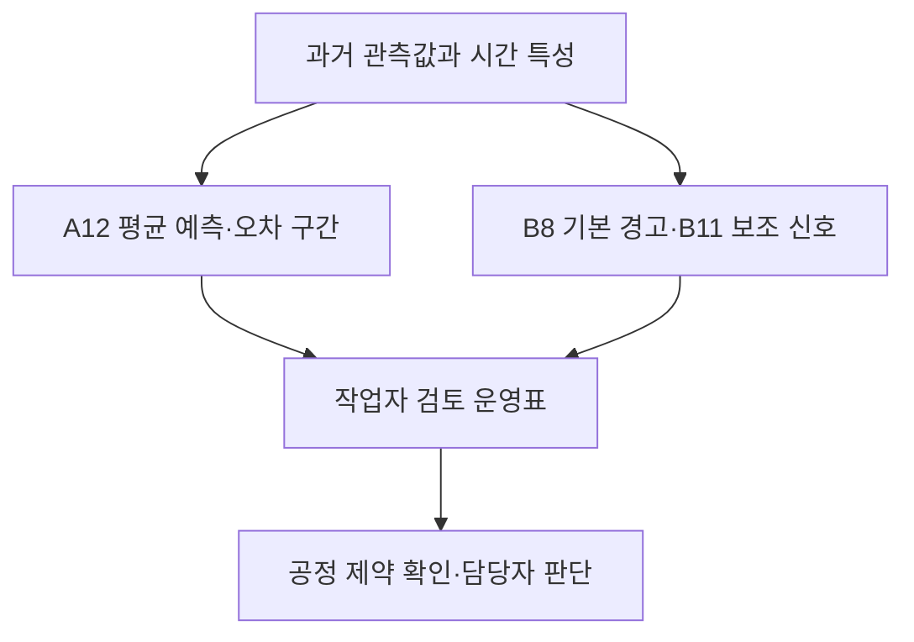

# NangniProcess | 평균 전력 예측과 피크 경보

**제6회 K-인공지능 제조데이터 분석 경진대회 · 과제 5**

제조 생산데이터의 과거 관측값으로 시간별 평균 전력을 예측하고, 시간 내 높은 부하를 사전에 경고하는 프로젝트입니다. 평균 예측, 피크 경고, 예측 불확실성을 같은 시각의 운영표에 연결해 작업자가 우선 검토할 시간을 제안합니다.

[실행 노트북](RUN_ALL.ipynb) · [KAMP-NOTE 실행 기록](evidence/kamp_note_run.log)

## 프로젝트 구성

| 구성 | 역할 | 구현 |
| --- | --- | --- |
| A12 | 시간별 평균 전력 예측 | 수준·변화량 ExtraTrees 예측을 0.45:0.55로 결합하고, 주간 누적 재학습과 과거 72시간 잔차 중앙값 보정 적용 |
| B5 / B7 → B8 | 기본 피크 경고 | ET·CatBoost 위험점수와 LightGBM Q85 최댓값 예측 중 하나가 기준을 충족하면 경고 |
| B11 | 보조 검토 신호 | 개발구간에서 선택한 적응형 기준을 적용해 추가 검토 시각 제안 |
| 운영표 | 작업자 검토 우선순위 | NORMAL / WATCH / WARNING과 평균 예측 오차 구간 표시 |
| 공정 제약 엔진 | 조치 가능 여부 확인 | 물질수지·재고·운전시간·재기동 등 제약 검사, 입력 부족 시 조치 보류 |



## 데이터 진단과 평가

원본 6,168행 × 18열에서 잘못된 시간값 48행을 구분했습니다. 과거 특성을 구성할 수 있는 5,856시간을 시간순으로 Train 4,099시간, Validation 878시간, Later 879시간으로 나눴습니다. 현재 시간의 전력 측정값·평균·실제 생산량 및 정답에서 파생되는 공장인원은 예측 입력에서 제외했습니다.

피크는 해당 시간의 15·30·45·60분 측정값 중 최대값이 **176 이상**인 경우입니다. 이는 데이터에서 정한 경험적 기준입니다. 모델·정책 선택과 후속 평가는 구분했지만, Later에는 프로젝트의 이전 A 분석에서 열람한 이력이 있습니다.

## 주요 결과

아래는 2026-10-05 KAMP-NOTE CPU 환경에서 원본부터 선택 모델을 새로 학습한 실행 결과입니다. 성능 수치의 근거는 [분류 성능표](results/classification_metrics.csv)와 [실행 매니페스트](evidence/kamp_note_manifest.json)에 있습니다.

| 지표 | Validation 878시간 | Later 879시간 |
| --- | ---: | ---: |
| A12 평균 전력 MAE | 4.54758 | 5.54113 |
| B8 피크 재현율 | 94.87% | 90.23% |
| B8 F1 | 0.9108 | 0.8509 |
| 직전 시간 피크 기준선 F1 | 0.6817 | 0.6533 |
| B8 포착 피크 / 실제 피크 | 148 / 156 | 157 / 174 |
| B8 오경보 / 미탐지 | 21 / 8 | 38 / 17 |

Later의 고정 90% 평균 예측 구간 포함률은 91.01%입니다. 운영표는 NORMAL 649시간, WATCH 35시간, WARNING 195시간이며, WATCH와 WARNING을 합친 230시간이 작업자 검토 대상입니다. B11 단독 지원 신호는 Later 재현율 97.70%와 오경보 58건을 기록했으며, B8 밖의 지원 신호를 WATCH로 분리했습니다.

## 실행 방법

**Python 3.11 환경을 권장합니다.** 실제 검증 환경은 Python 3.11.9와 `requirements.txt`의 고정 버전입니다.

1. 저장소를 내려받습니다.
2. 별도로 보유한 공식 과제 5 원본 ZIP을 `data/KAMP_5_data.zip`에 배치합니다. 이 저장소에는 원본 데이터가 포함되지 않습니다. 입력 조건은 [데이터 안내](data/README.md)를 확인하세요.
3. 저장소 루트에서 다음 명령을 실행합니다.

```bash
python -m pip install -r requirements.txt
python run_all.py --data data/KAMP_5_data.zip --output outputs
```

Jupyter 환경에서는 저장소 루트를 작업 폴더로 설정하고 [RUN_ALL.ipynb](RUN_ALL.ipynb)를 실행할 수 있습니다. Colab에서는 저장소를 먼저 복제하거나 업로드한 뒤 그 폴더로 이동하고 원본 ZIP을 배치해야 합니다.

실행은 원본 검사 → 전처리 → 고정 선택 모델 새 학습 → 시간순 예측 → 경고·운영표 생성 순서로 진행됩니다. 과거 예측 CSV나 Drive 체크포인트를 학습 입력으로 사용하지 않습니다. 선택하지 않은 후보 전체 탐색은 이 실행본에 포함되지 않습니다.

결과는 `outputs/RUN_<UTC>/`에 저장됩니다. 실행 매니페스트의 상태 `PASS_SUBMISSION_RAW_TO_RESULTS`로 완료 여부를 확인합니다. 기존 검증에서는 KAMP-NOTE CPU 약 4.09분, Colab 약 12.88분이 소요됐으며 환경에 따라 달라집니다. 이번 GitHub 정리는 기존 제출 코드의 보존·구성 확인이며 새로운 모델 재학습 결과를 주장하지 않습니다.

## 저장소 안내

| 경로 | 내용 |
| --- | --- |
| `run_all.py`, `RUN_ALL.ipynb` | 선택 모델의 원본부터 결과까지 실행 |
| `src/` | 분류·회귀 정의, 전처리, 공정 제약 엔진 |
| `requirements.txt` | 검증에 사용한 패키지 버전 |
| `data/README.md` | 별도 준비할 원본 데이터와 해시 안내 |
| `predictions/test_predictions.csv` | 제출된 Later 879시간 예측·검토 신호; 같은 시각의 실제 정답 제외 |
| `results/` | 집계 성능표, 공정 필수 입력 목록, 가상 사례 |
| `docs/` | 원래 제출본 설명·매니페스트 |
| `evidence/` | 기존 KAMP-NOTE 환경·실행 기록 |
| `REPOSITORY_MANIFEST.json` | GitHub용 구성의 파일 무결성 정보 |

`docs/original_submission_manifest.json`은 원본 데이터가 포함됐던 **기존 제출 ZIP**의 기록입니다. GitHub용 구성은 `REPOSITORY_MANIFEST.json`으로 구분합니다. 기존 코드의 내부 해시 검사를 유지하기 위해 모델 소스와 실행 코드는 제출본 바이트 그대로 보존했습니다.

## 적용 범위와 한계

- 176은 경험적 피크 경계이며 계약전력이나 실제 전기요금 기준으로 확인되지 않았습니다.
- B5 위험점수를 보정된 발생확률로 해석하지 않습니다.
- Later는 시간상 후속 구간이지만 프로젝트 전체의 완전 미열람 홀드아웃은 아닙니다. A12 Later MAE는 A11의 5.48315보다 높습니다.
- 시간별 관측이 순차 도착해야 과거 특성과 온라인 보정을 갱신할 수 있습니다. 실제 공장 데이터 수집·연동 서비스는 구현 범위에 포함되지 않습니다.
- 실제 설비·재고·제품 전환 등 필수 입력 27항목이 부족해 실제 일정 후보와 자동제어는 각각 0건입니다. 가상 공정의 피크 13→9는 실제 절감 실적이 아닙니다.
- 원본 데이터와 이를 포함한 체크포인트 ZIP은 재배포 조건이 확인되지 않아 저장소에서 제외했습니다. 코드 열람·결과 확인은 가능하지만 재학습에는 원본을 별도로 준비해야 합니다.

## 작성 및 이용

**NangniProcess**

이 저장소는 경진대회 제출 작업을 설명하고 재현 방법을 공유하기 위한 구성입니다. 별도의 오픈소스 라이선스는 지정하지 않았으며, 원본 데이터의 이용 조건은 제공처 안내를 따릅니다.
